# Front-End course from Kottans

## Self-Study stage

### 1. [Git intro](https://github.com/kottans/frontend/blob/master/tasks/git-intro.md)

* [UDACITY: Version Control with Git](https://www.udacity.com/course/version-control-with-git--ud123)  
* [learngitbranching.js.org](https://learngitbranching.js.org/)
* 

  

    <small>screenshots</small>
  

  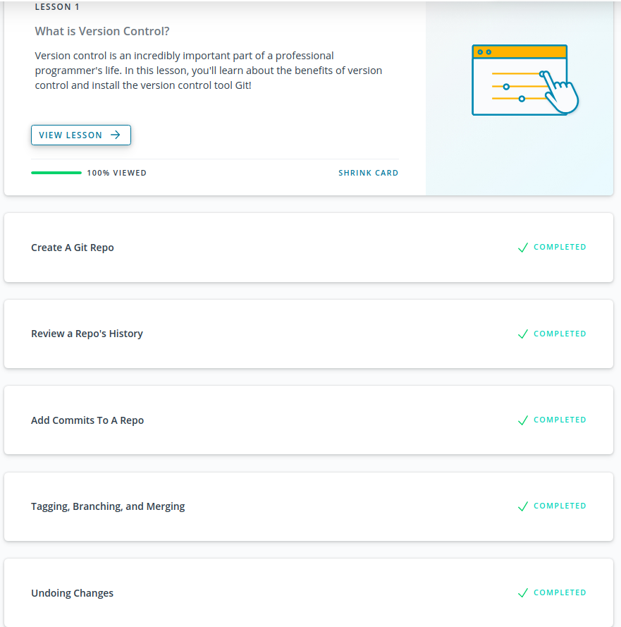
  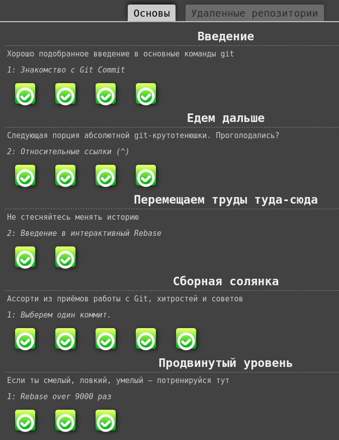

  

>*I've been familiar with git for a long time, but very superficially: limiting itself to the basic set of commands, and within the repository for one developer. I've tried branches just to be able to do it. I have long wanted to understand deeper. But with limited time, you have to choose. I am very glad that such an opportunity finally fell out.*
>
>*Two ideas that interest me as a result:*  
>*1. Learn to use the git to monitor progress on my training projects.*  
>*2. Accordingly, highlight small goals in the work so that the history of the commits is clear and understandable.*

  

### 2. [Linux CLI, and HTTP](https://github.com/kottans/frontend/blob/master/tasks/linux-cli-http.md)

  

    <small>screenshots</small>
  

  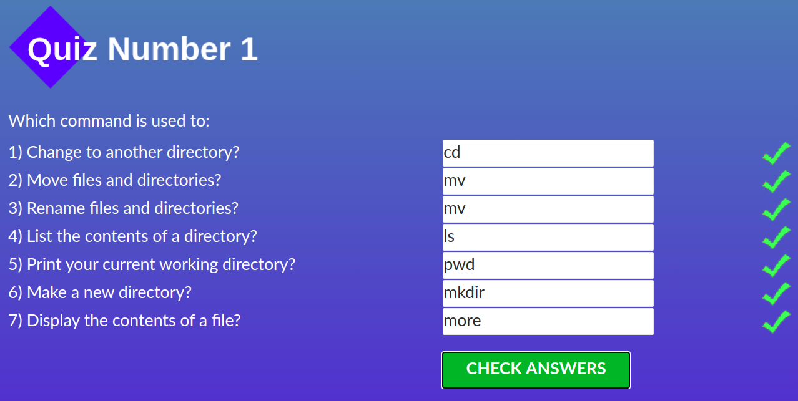
  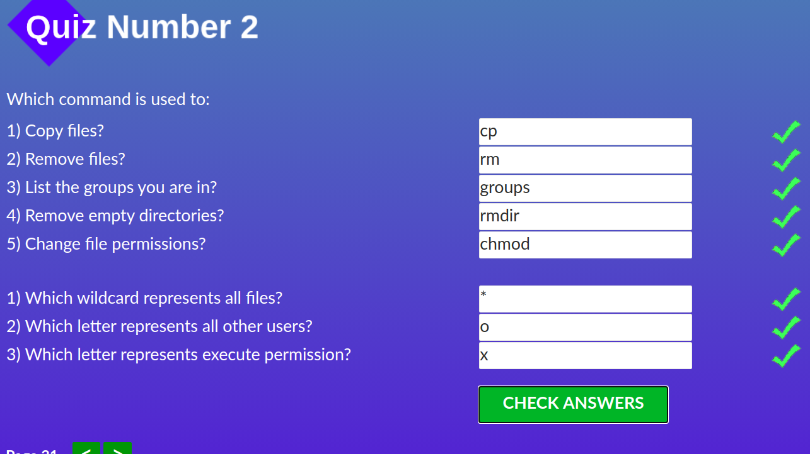
  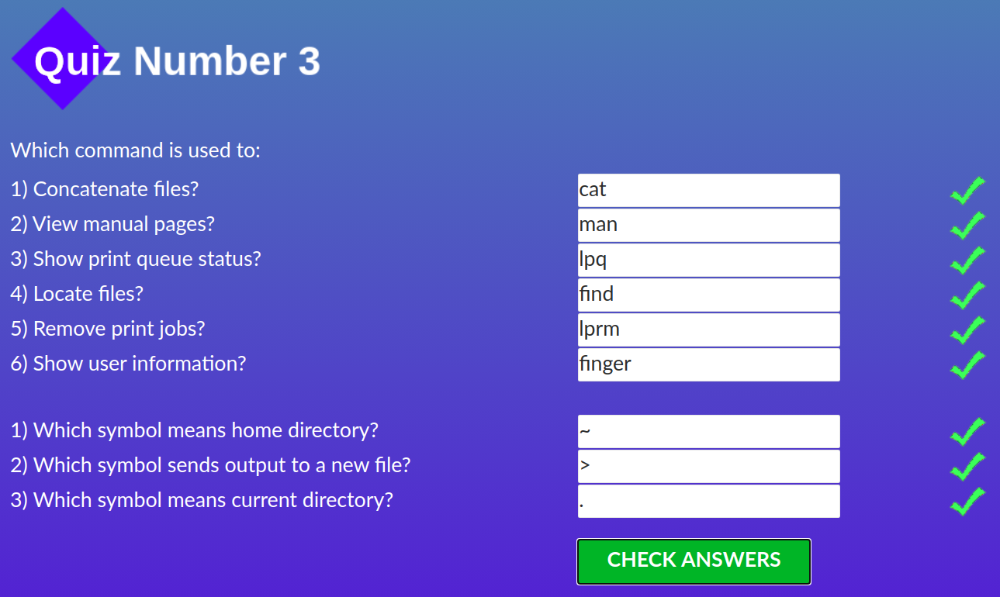
  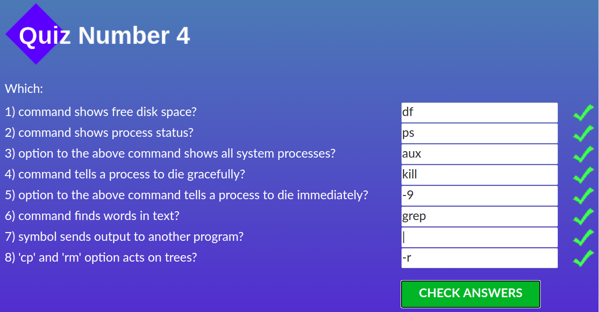

>*I have been a happy user of Ubuntu for a long time, so nothing new except that dubious printer stuff :)*
>
>*As a person who wants to know everything, I certainly studied the topic of HTTP, and now I have repeated it. But without practical use, this knowledge does not linger in my head...*

  

### 3. [Git Collaboration](https://github.com/kottans/frontend/blob/master/tasks/git-collaboration.md)

  

    <small>screenshots</small>
  

  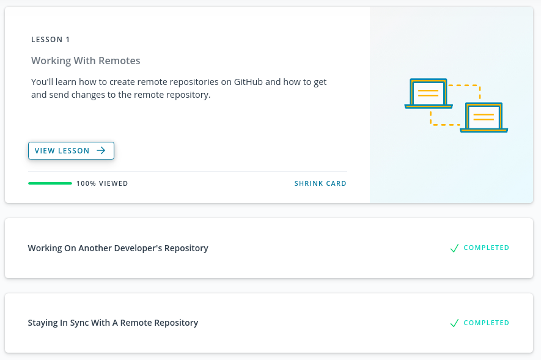
  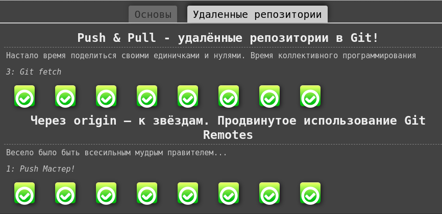

>*Wow, doing the PR turned out to be not at all what I thought. The scheme of working in a local repository with two remote branches (forked origin and upstream) is something new for me. Although, this is logical given what has been learned. Now I can contribute to open source!*
>
>*It remains only to find out who I want to help... 	&#129300;*

  

### 4. [Intro to HTML and CSS](https://github.com/kottans/frontend/blob/master/tasks/html-css-intro.md)

  

    <small>screenshots</small>
  

  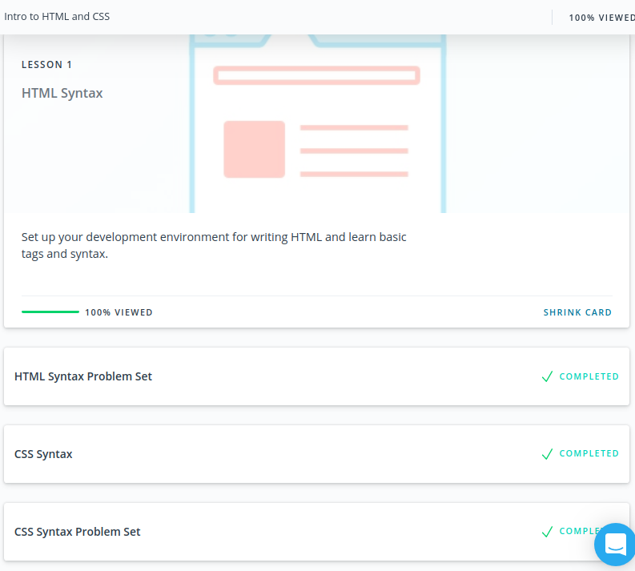
  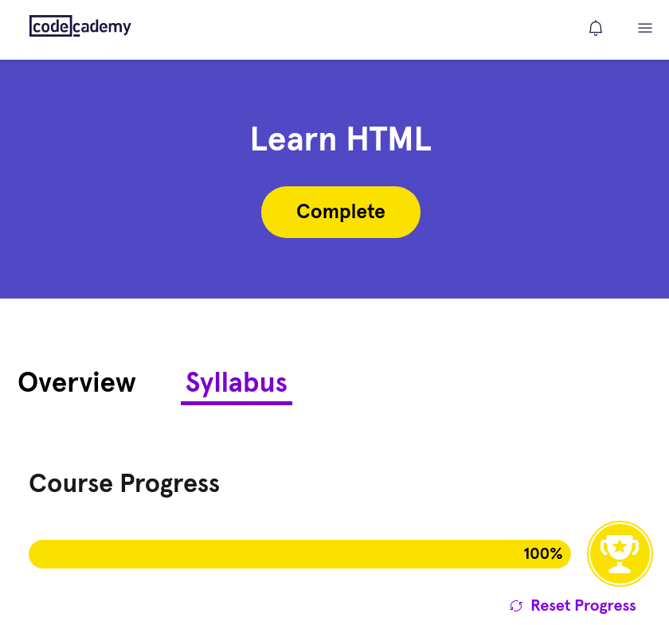
  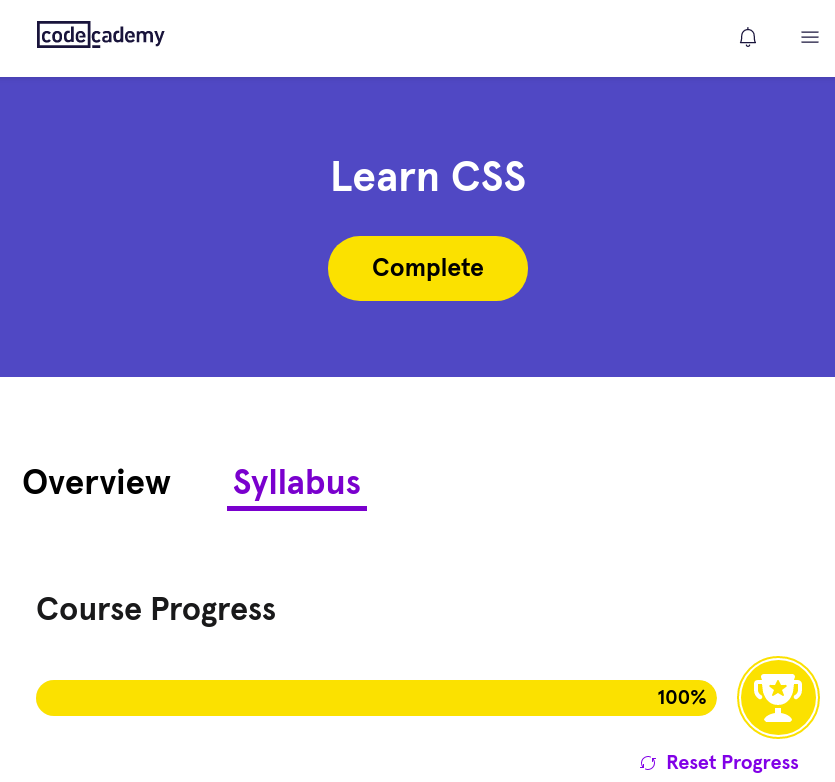

>*Basically, all the information was already familiar to me, so the courses were taken in fast forward mode. Except for grids, I'm glad to finally touch them. It looks like a very powerful thing.*

  

### 5. [Responsive Web Design](https://github.com/kottans/frontend/blob/master/tasks/html-css-responsive.md)

  

    <small>screenshots</small>
  

  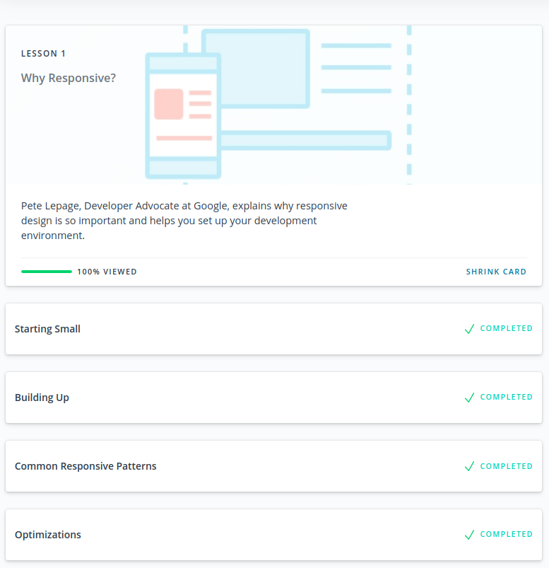
  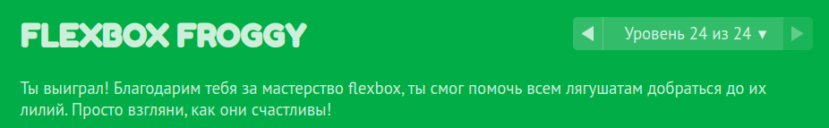

>*It turned out that until now I have never used the order property in flexbox. Either I didn’t know about it, or I forgot.*
>
>*Also, it was news to me that there are responsive patterns and they have names: Column Drop, Mostly Fluid, Layout Shifter and Off Canvas. I used only the first of them, which, apparently, corresponds to the level of my development ))*

  

### 6. [HTML & CSS practice](https://github.com/kottans/frontend/blob/master/tasks/html-css-popup.md): [Hooli-style Popup](https://github.com/Iakow/hooli-popup)

>*It was a novelty for me to work without JS - this allowed me to learn a little more about the capabilities of the CSS.*
>
>*In particular, the checkbox hack - onClick() without programming* ))
>
>*Until now, I have not paid attention to keyboard accessibility, and have never tried using the keyboard for navigation myself. In the process, I had to study the list of focusable elements in order to guide the user in the right way. It was interesting.*
>
>*I figured out how to flexibly set background images without cluttering  `` in HTML.*
>
>*It turned out that the border radius cannot be set for the outline. And there are also different hacks, but here I went the simple way - I used rectangular hovers)) But I know where to look if necessary.*
>
>*Well, it was interesting to play with the styling of the scrollbar.*

  

### 7. [JS Basics](https://github.com/kottans/frontend/blob/master/tasks/js-basics.md)

  

    <small>screenshots</small>
  

  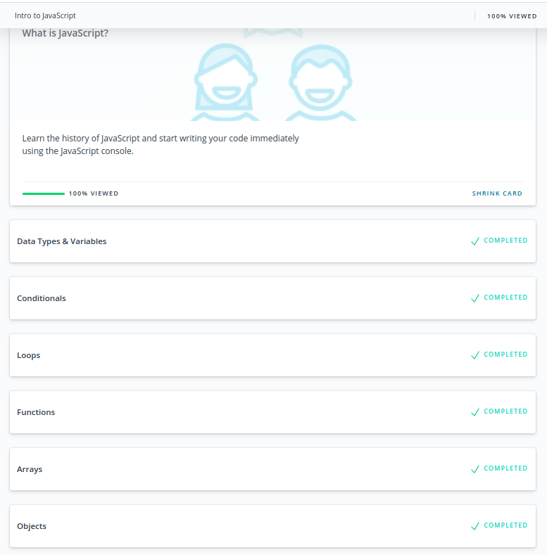
  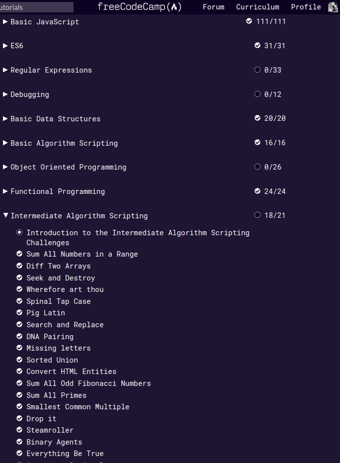

>*Ummm ... Nothing to say because everything was familiar. Unless it was interesting to write scripts, sometimes it looks like real tasks.*
