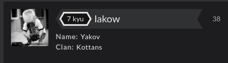

# Front-End course from Kottans

## Self-Study stage

### 1. Git intro

- [x] [UDACITY: Version Control with Git](https://www.udacity.com/course/version-control-with-git--ud123)  
- [x] [learngitbranching.js.org](https://learngitbranching.js.org/)
<details>
  <summary>
    <small>screenshots</small>
  </summary>

  
  
</details>


>*I've been familiar with git for a long time, but very superficially: limiting itself to the basic set of commands, and within the repository for one developer. I've tried branches just to be able to do it. I have long wanted to understand deeper. But with limited time, you have to choose. I am very glad that such an opportunity finally fell out.*
>
>*Two ideas that interest me as a result:*  
>*1. Learn to use the git to monitor progress on my training projects.*  
>*2. Accordingly, highlight small goals in the work so that the history of the commits is clear and understandable.*

<br><br>


### 2. [Linux CLI, and HTTP](https://github.com/kottans/frontend/blob/master/tasks/linux-cli-http.md)

<details>
  <summary>
    <small>screenshots</small>
  </summary>

  
  
  
  
</details>

>*I have been a happy user of Ubuntu for a long time, so nothing new except that dubious printer stuff :)*
>
>*As a person who wants to know everything, I certainly studied the topic of HTTP, and now I have repeated it. But without practical use, this knowledge does not linger in my head...*

<br><br>


### 3. [Git Collaboration](https://github.com/kottans/frontend/blob/master/tasks/git-collaboration.md)

<details>
  <summary>
    <small>screenshots</small>
  </summary>
  
  
</details>

>*Wow, doing the PR turned out to be not at all what I thought. The scheme of working in a local repository with two remote branches (forked origin and upstream) is something new for me. Although, this is logical given what has been learned. Now I can contribute to open source!*
>
>*It remains only to find out who I want to help... 	&#129300;*

<br><br>


### 4. [Intro to HTML and CSS](https://github.com/kottans/frontend/blob/master/tasks/html-css-intro.md)

<details>
  <summary>
    <small>screenshots</small>
  </summary>
  
  
  
</details>

>*Basically, all the information was already familiar to me, so the courses were taken in fast forward mode. Except for grids, I'm glad to finally touch them. It looks like a very powerful thing.*

<br><br>


### 5. [Responsive Web Design](https://github.com/kottans/frontend/blob/master/tasks/html-css-responsive.md)

<details>
  <summary>
    <small>screenshots</small>
  </summary>
  
  
</details>

>*It turned out that until now I have never used the order property in flexbox. Either I didn’t know about it, or I forgot.*
>
>*Also, it was news to me that there are responsive patterns and they have names: Column Drop, Mostly Fluid, Layout Shifter and Off Canvas. I used only the first of them, which, apparently, corresponds to the level of my development ))*


<br><br>

### 6. [HTML & CSS practice](https://github.com/kottans/frontend/blob/master/tasks/html-css-popup.md): [Hooli-style Popup](https://github.com/Iakow/hooli-popup)

>*It was a novelty for me to work without JS - this allowed me to learn a little more about the capabilities of the CSS.*
>
>*In particular, the checkbox hack - `onClick()` without programming* ))
>
>*Until now, I have not paid attention to keyboard accessibility, and have never tried using the keyboard for navigation myself. In the process, I had to study the list of focusable elements in order to guide the user in the right way. It was interesting.*
>
>*I figured out how to flexibly set background images without cluttering  `` in HTML.*
>
>*It turned out that the border radius cannot be set for the outline. And there are also different hacks, but here I went the simple way - I used rectangular hovers)) But I know where to look if necessary.*
>
>*Well, it was interesting to play with the styling of the scrollbar.*

<br><br>


### 7. [JS Basics](https://github.com/kottans/frontend/blob/master/tasks/js-basics.md)

<details>
  <summary>
    <small>screenshots</small>
  </summary>
  
  
</details>

>*Ummm ... Nothing to say because everything was familiar. Unless it was interesting to write scripts, sometimes it looks like real tasks.*

<br><br>


### 8. [Document Object Model](https://github.com/kottans/frontend/blob/master/tasks/js-dom.md)
- [x] [JavaScript and the DOM](https://classroom.udacity.com/courses/ud117)  
- [x] [Freecodecamp Algorithm Scripting Challenges](https://learn.freecodecamp.org/javascript-algorithms-and-data-structures/intermediate-algorithm-scripting)
- [x] [Practical task](https://github.com/Iakow/kottans-js-dom)
<details>
  <summary>
    <small>screenshots</small>
  </summary>
  
  
</details>

>*It was new for me to get acquainted with the `Node`, `Element` and `EventTarget` interfaces and how they are connected. Of course, I have not memorized much, but now I know the sources of information, and in general it has slightly expanded my consciousness.*
>
>*It was cool to understand the performance issues when working with DOM: you need to keep in mind the problems associated with reflow and re-paint. In particular, hack with `document fragment` is great for solving such problems.*
>
>*And I first learned about `performance.now()`! I played a lot with this, measuring performance with different approaches))*
>
>*Overall, at the moment this task has brought me the most pleasure and gave me the feeling that I am getting closer to becoming a developer. And yet, I understood what the react.js is for in fact))*

<br><br>


### 9. [Building a Tiny JS World (pre-OOP)](https://github.com/kottans/frontend/blob/master/tasks/js-pre-oop.md)
- [x] [My JS tiny world](https://github.com/Iakow/my-tiny-js-world)
- [code](https://github.com/kottans/frontend-2021-homeworks/blob/main/submissions/iakow/a-tiny-js-work/index.js)

<br><br>

### 10. [Object-Oriented JavaScript ](https://github.com/kottans/frontend/blob/master/tasks/js-oop.md)
- [x] [Object Oriented JS](https://classroom.udacity.com/courses/ud015)
- [x] [codewars 7kyu](https://www.codewars.com/users/Iakow)
- [x] [Frogger game](https://iakow.github.io/frontend-nanodegree-arcade-game/)
- [code](https://github.com/kottans/frontend-2021-homeworks/blob/main/submissions/iakow/object-oriented-js/app.js)
<details>
  <summary>
    <small>screenshots</small>
  </summary>
    
  
</details>  
  
>*It is difficult to highlight specific things, because here it is more likely not about "I learned how to do it", but about "I began to understand how it works". Overall, аfter 100 laps through this sea of information, and a bunch of experiments with the code, I feel a lot more confident with topics such as scopes, this, closures, and prototypes.*
<details>
  <summary>
    <small>more</small>
  </summary>

>*When you pass a method to another object and that object calls it, `this` behaves unexpectedly)) Now I understand why in React code such methods are bound in the constructor: behavior of `this` can be determined by only 4 rules, they should just be [memorized](https://github.com/getify/You-Dont-Know-JS/blob/1st-ed/this%20%26%20object%20prototypes/ch2.md).*
>
>*It took me a lot of time to understand that in OOP application, objects are not at all required to represent a strict tree-like hierarchy like components in a React application. That is, OOP objects are not React components at all!!! OMG))*
</details>

<br><br>

### 11. [OOP exercise (TinyJSWorld2)](https://github.com/kottans/frontend/blob/master/tasks/js-post-oop.md)
- [x] [My JS tiny world](https://iakow.github.io/my-tiny-js-world/)
- [code](https://github.com/kottans/frontend-2021-homeworks/blob/main/submissions/iakow/OOP-exercise/index.js)

<br><br>

### 12. [Memory – Pair Game)](https://github.com/kottans/frontend/blob/master/tasks/memory-pair-game.md)
- [ ] [Demo]()
- [code]( )

<details>
  <summary>
    <small>What I noted for myself</small>
  </summary>

> *`QuerySelectorAll()` and `getElementsBuy()` do seemingly the same work, but in reality the results are different: the first returns a [NodeList](https://developer.mozilla.org/en-US/docs/Web/API/NodeList), and the second returns [HTMLCollection](https://developer.mozilla.org/en-US/docs/Web/API/HTMLCollection). The last one cannot be iterated over `forEach()`, for example.*

>*This is the first time I have used `Map` consciously and finally realized its convenience. You can bind data to an `Element` without using `id` or custom built-in properties.*

>*And custom built-in properties of element, by the way, are erased if you try to pass an element somewhere in the DOM using `InnerHTML`*

>*I got to know Promises better and appreciated the benefits of replacing callbacks with them when working with asynchronous things.*

>*And by the way, what surprised me is that the rendering runs asynchronously.*
>```
>document.body.style.backgroundColor = 'red';
>alert('surprize!'); 
>```

>*At some point, I noticed that I accidentally created a global variable, forgetting to write `const` in the declaration. This didn't affect the app execution, but when I turned on `strict mode` - I found another one :facepalm: From now on, I will always `use strict`.*
</details>
